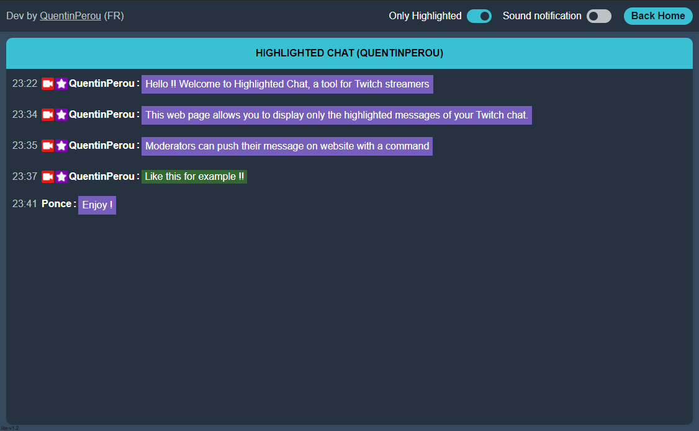

# Twitch-HighlightedChat-lite  

<!-- This is the **lite** version of the project.   -->

A tool for Twitch streamers. This web page allows you to display only the highlighted messages of your Twitch chat.

<!-- ➜ https://highlightedchat.quentinperou.fr   -->
➜ https://highlightedchat-lite.netlify.app  

 

_Inspired by [Ponce](https://twitch.tv/ponce)_  
_Made by [QuentinPerou](https://twitch.tv/quentinperou)_ 

Host on Netlify.  

<!-- 

  

 -->

***

## Features
- Show all chat messages
- Show only highlighted messages
- Sound notification for highlighted messages
- Click on a highlighted message to mark it as read
- Moderators can push their message on website with command "`!+hmsg <MESSAGE>`"
- Stores messages in local memory for 5 days
- Colorize mention
- Display animated emotes
- Hide messages deleted by moderators

## Changelog
To see the list of recent changes, see [Releases section](https://github.com/quentinperou/Twitch-HighlightedChat-lite/releases).  
To see the progress of new features development, see the [Project section](https://github.com/quentinperou/Twitch-HighlightedChat-lite/projects/1).

## Resources
This projetc use:  
- [ComfyJS](https://github.com/instafluff/ComfyJS)

***
## Developer
- [QuentinPerou](https://github.com/quentinperou) ▶ Twitch : https://twitch.tv/quentinperou

 

*Version : lite-v2.3*
